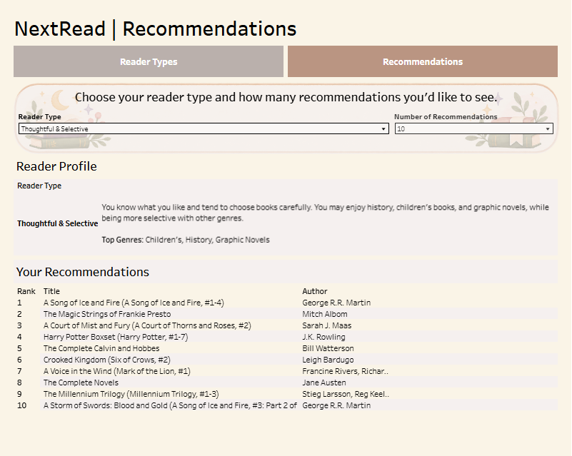
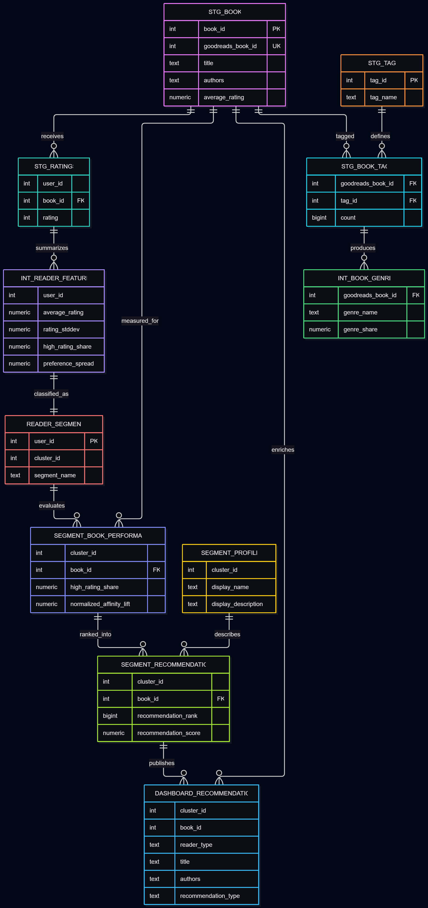

# NextRead

A business analytics and recommendation project designed to help BCG readers discover highly rated books beyond their usual reading preferences.

## Table of Contents

1. [Client Background](#client-background)
2. [North Star Metrics](#north-star-metrics)
3. [Executive Summary](#executive-summary)
4. [Tableau Dashboard](#tableau-dashboard)
5. [ERD & Data Structure](#erd--data-structure)
6. [Insights Deep Dive](#insights-deep-dive)
7. [Current State](#current-state)
8. [Future Updates](#future-updates)

---

## Client Background

BCG is a national book reading group focused on increasing reader participation and creating more varied community conversations.

Traditional recommendation systems often reinforce familiar genres, authors, and reading patterns. BCG wanted a way to introduce readers to books they might not normally consider while still maintaining a strong likelihood that those books would be well received.

NextRead was developed to answer one central business question:

> **How often can BCG recommend an unusual book that a reader is still likely to rate highly?**

The project combines reader behavior, genre preferences, segmentation, recommendation scoring, and validation to identify books that perform well with similar readers while extending beyond their strongest genre preferences.

---

## North Star Metrics

**Recommendation Success** - Focusing on how often readers receive recommendations they are likely to rate highly, measured through reader hit rate and successful recommendation outcomes.

**Recommendation Performance** - Comparing NextRead against a traditional global recommendation approach using lift in Top-25 recommendation success.

**Discovery Success** - Measuring how effectively NextRead surfaces highly rated books outside a reader type’s strongest genre preferences, including discovery hit rate and discovery diversity.

**Dashboard Effectiveness** - Ensuring the recommendation experience is usable at scale through reader coverage, recommendation depth, and consistent delivery of Top 10 and Top 25 recommendations.

### Success Definition

NextRead is successful when it can recommend books that are both:

1. **Relevant** — readers are likely to rate them highly.
2. **Different** — recommendations extend beyond the reader type's strongest genre preferences.

The primary business outcome is therefore not simply recommendation accuracy, but the ability to create **successful discovery**.

---

## Executive Summary

NextRead was developed for BCG, a national book reading group seeking to improve how members discover books beyond the titles and genres typically surfaced by traditional recommendation systems.

The final model analyzed more than 53,000 readers and grouped them by shared reading behavior and genre preferences. At the Top-25 recommendation level, **12.59% of evaluated readers received at least one book they later rated 4 or 5 stars**, representing a **5.27× improvement over a global recommendation baseline**.

NextRead also achieved its discovery objective. **29.6% of Top-25 recommendations fell outside a reader type’s three strongest genres**, and **32.03% of readers with a successful recommendation received at least one highly rated discovery book**.

The final product is a two-tab Tableau dashboard that allows BCG members to identify their reader type and receive a ranked list of Top 10 or Top 25 recommendations. The dashboard is currently being used as a pilot while BCG gathers feedback and evaluates whether the model should be expanded to a broader book catalog.

---

## Tableau Dashboard

The final NextRead product is a two-tab Tableau dashboard designed for BCG members.

### Reader Types

The first tab introduces the five reader types in simple, public-facing language so users can identify the profile that best matches their reading preferences.

### Recommendations

The second tab allows users to:

- Select their reader type
- Choose between Top 10 or Top 25 recommendations
- View a ranked list of recommended books
- See the author associated with each recommendation

The dashboard is intentionally simple and nontechnical. Model methodology, validation, and analytical details are documented in this README rather than shown to end users.

**[View the Tableau Dashboard] (https://public.tableau.com/views/NextReadRecommendations/ReaderTypes?:language=en-US&:sid=&:redirect=auth&:display_count=n&:origin=viz_share_link)**

---

## ERD & Data Structure

NextRead uses a layered PostgreSQL structure to separate source data, cleaning, analytical transformations, and final reporting outputs.

### Data Structure

**Raw** - Preserves the original Goodbooks source data for traceability.

**Staging** - Cleans and standardizes books, ratings, tags, and reader activity while preserving validated relationships between entities.

**Intermediate** - Builds analytical features including reader behavior, genre preferences, segment-level book performance, recommendation candidates, and validation outputs.

**Mart** - Stores final business-ready outputs used for reader profiles, recommendation rankings, validation summaries, and Tableau reporting.

### Analytical Flow

`Source Data → Staging → Reader Features → Reader Segments → Segment-Book Performance → Recommendation Ranking → Tableau`

The layered structure keeps transformation logic traceable and separates technical processing from the final business-facing outputs.

### Entity Relationship Diagram

---

## Insights Deep Dive

### 1. NextRead materially improved recommendation performance

At the Top-25 level, **12.59% of evaluated readers received at least one book they later rated 4 or 5 stars**.

This represented a **5.27× improvement over a global recommendation baseline**, indicating that grouping readers by shared preferences and rating behavior produced more relevant recommendations than recommending broadly popular books.

### 2. Discovery and recommendation quality can coexist

NextRead was designed to go beyond familiar reading patterns without sacrificing recommendation quality.

At the Top-25 level:

- **29.6% of recommendations** fell outside a reader type's top 3 genres.
- **32.03% of readers with a successful recommendation** received at least one highly rated discovery book.
- **4.03% of all evaluated readers** received at least one highly rated book outside their reader type's top 3 genres.

These results suggest that successful recommendations do not need to remain limited to a reader's strongest existing preferences.

### 3. Discovery performance varies by reader type

The strongest discovery results came from **Thoughtful & Selective** readers.

At the Top-25 level:

- **24.47%** received at least one highly rated recommendation.
- **11.47%** received at least one highly rated discovery recommendation.
- **46.87%** of successful readers in this group received a discovery success.

By comparison, **Visual & Imaginative** readers received successful recommendations, but those successes remained within their strongest genre preferences.

This suggests that a single discovery strategy may not perform equally well across all reader types.

### 4. Reader type matters beyond genre alone

Some reader types share similar top genres but still respond differently to recommendations.

For example, **Visual & Imaginative** and **Open-Minded Explorer** readers both show strong preferences for Graphic Novels, Children's, and Fantasy, but their recommendation behavior differs because the model also considers broader rating patterns and preference behavior.

This supports using reader behavior and genre preferences together rather than relying on genre alone.

---

## Current State

BCG is currently using the NextRead dashboard as a pilot recommendation tool.

The dashboard allows members to identify their reader type and receive Top 10 or Top 25 book recommendations based on the behavior and preferences of similar readers.

BCG is using the pilot period to gather real-world feedback on:

- Whether members find the recommendations relevant
- Whether discovery recommendations introduce books they would not normally consider
- Which reader types respond best to cross-genre recommendations
- Whether the current book catalog is large enough to support continued use

The current pilot is intended to help determine whether NextRead should be expanded to a broader catalog and used more widely across BCG.

---

## Future Updates

NextRead is currently limited by the size and scope of the Goodbooks-10k dataset. Future development will focus on expanding the recommendation catalog and validating performance with real-world BCG usage data.

Planned updates include:

- **Expand the book catalog** using a larger Goodreads dataset or Amazon book data.
- **Retrain reader profiles and recommendation logic** as the catalog grows.
- **Use BCG pilot feedback** to measure how often members engage with and positively respond to recommendations.
- **Evaluate discovery performance by reader type** to determine whether different groups benefit from different recommendation strategies.
- **Refine recommendation ranking** using real usage data rather than relying only on historical ratings behavior.

The next major decision is whether the pilot demonstrates enough recommendation quality and discovery value to justify expanding NextRead to a broader catalog.